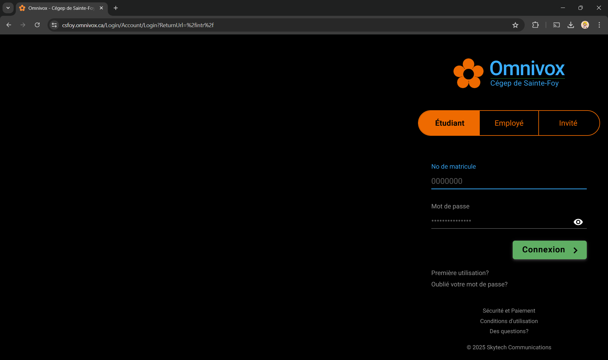
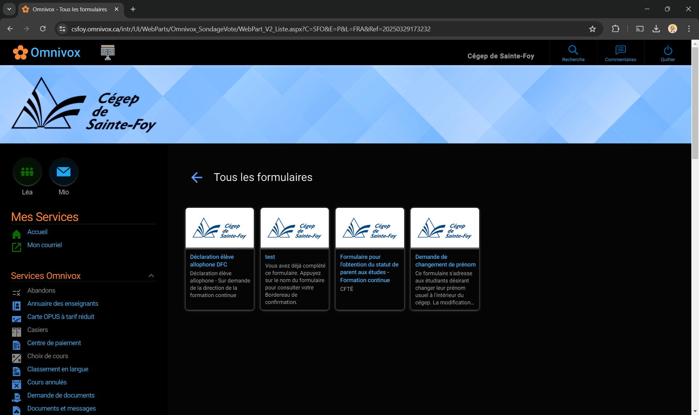

 

  

  <h3 align="center">Dark Omnivox</h3>

  

    Extension Google Chrome
     
    <a href="#about"><strong>Explore the screenshots »</strong></a>
       
       
      <a href="https://github.com/TheBeesness/dark_omnivox/issues/new?assignees=&labels=bug&template=01_BUG_REPORT.md&title=bug%3A+">Report a Bug</a>
      ·
      <a href="https://github.com/TheBeesness/dark_omnivox/issues/new?assignees=&labels=enhancement&template=02_FEATURE_REQUEST.md&title=feat%3A+">Request a Feature</a>
      ·
      <a href="https://github.com/TheBeesness/dark_omnivox/issues/new?assignees=&labels=question&template=04_SUPPORT_QUESTION.md&title=support%3A+">Ask a Question</a>
  

  ## Table of Contents
  <ol>
    <li>
      <a href="#about">About</a>
      <ul>
        <li><a href="#built-with">Built With</a></li>
      </ul>
    </li>
    <li>
      <a href="#getting-started">Getting Started</a>
      <ul>
        <li><a href="#prerequisites">Prerequisites</a></li>
        <li><a href="#installation">Installation</a></li>
      </ul>
    </li>
    <li><a href="#usage">Usage</a></li>
    <li><a href="#monitoring-tools-overview">Monitoring Tools Overview</a></li>
    <li><a href="#authors--contributors">Authors & Contributors</a></li>
    <li><a href="#acknowledgments">Acknowledgments</a></li>
  </ol>

## About
Omnivox is a web platform widely used in Quebec educational institutions, particularly CEGEPs. It allows students to access various information and services, such as their schedules, academic results, messages, and much more.

**dark_omnivox** is a Google Chrome extension designed to enhance your Omnivox experience by applying a stylish dark theme. This extension aims to reduce eye strain and make using Omnivox more comfortable, especially in low-light environments.

 

    
 

 
🛠️ HOME PAGE  

🎨 Omnivox pgae  

## Getting Started

### Prerequisites

* Google Chrome (dernière version recommandée)

### Installation

1.  Download the project as a ZIP file or clone the Git repository.
2.  Open Google Chrome and go to `chrome://extensions/`.
3.  Enable developer mode (in the top right corner).
4.  Click "Load unpacked".
5.  Select the folder containing the extension files.
6.  The "dark_omnivox" extension should now be installed and enabled.

## Usage

Once installed, the extension automatically activates when you visit the Omnivox website. No additional configuration is required (or specify the configuration steps here if there are any).

(<a href="#readme-top">back to top</a>)

